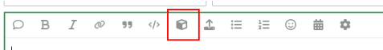
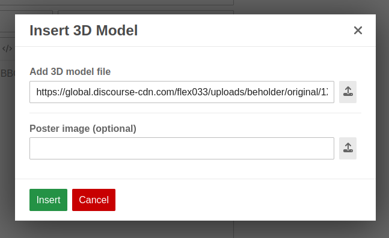
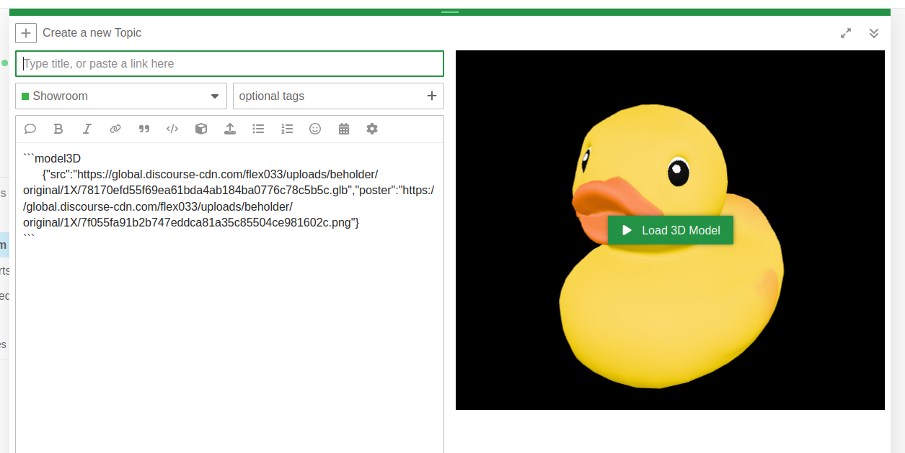
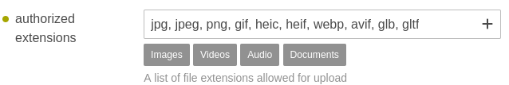
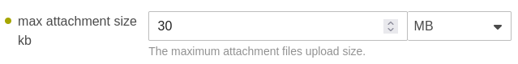

# discourse-insert-model-3d

This theme component adds a button to the composer that allows users to add 3D models to their Discord posts.

Currently the only file formats supported are Graphics Library Transmission Format files (.gltf and .glb).

## Usage

When the component is installed users will be able to add 3D models to their
posts by clicking on the new cube icon in the composer.

Currently the 3D viewer will not download and display the 3D model straight away, instead it will display a poster (that can be customised) and will only load the model when the user clicks the 'Load 3D Model' button. The thinking behind this is to help users with limited bandwidth.

## Admin Settings

In order for users to be able to upload models with this component you'll need to add .gltf and .glb to the list of authorized extensions.

You'll also likely need to up the limit for the max attachment size. 

This is the probably the main limitation for using this component on hosted Discourse as there, on the lower subscription plans, the max size is limited to 30MB. To be fair though you probably don't want your users to be uploading massive files and .glb and .gltf files can be greatly reduced in size if they're generated by a program that supports Draco mesh compression.